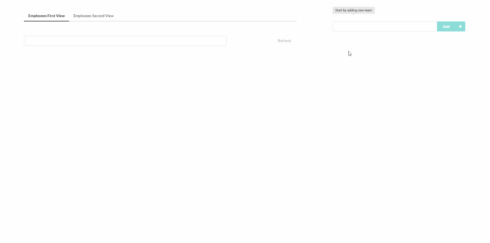

# Project Team Manager

App to manage project teams of developers
<br/><br/>

## Getting Started

To run the app you should:

1. Run ```npm i```
2. Run ```gulp serve```
3. Open your browser on: ```http://localhost:3000/```.


## Demo



<br/><br/>


## Project structure
```
.  
├── client                                  # source files  
│   ├── app                                 # entry module  
│   │   ├── common                          # module for components that are common for different parts of the application 
│   │   │   ├── pm-navbar                   # PmNavbar component's directory
│   │   │   ├── pm-teams                    # PmTeams component's directory
|   │   │   │   └── pm-add-team             # PmAddTeam component's directory
│   │   │   ├── common.js
│   │   │   └── common.scss
│   │   ├── components                      # module for all the other components
│   │   │   ├── pm-employees-first          # PmEmployeesFirst component's directory
│   │   │   ├── pm-employees-second         # PmEmployeesSecond component's directory
|   │   │   │   └── pm-employees-table      # PmEmployeesTable component's directory
│   │   │   └── components.js
│   │   ├── services                        # services of the app
│   │   │   ├── employees-services.js       
│   │   │   ├── teams-service.js
│   │   │   └── services.js
│   │   ├── app.component.js 
│   │   ├── app.controller.js 
│   │   ├── app.html 
│   │   ├── app.js 
│   │   └── app.scss 
│   ├── images                              # images for app  
│   ├── config.js                           # config that exports API_URL  
│   ├── dirPagination.tpl.html              # template for dirPagination directive  
│   └── index.html  
├── dist                                    # compiled files  
├── generator                               # skeleton of new components built with ```npm run component```  
├── node_modules              
├── .editorconfig  
├── .gitignore  
├── gulpfile.babel.js  
├── karma.conf.js  
├── package.json  
├── postcss.config.js  
├── spec.bundle.js  
├── webpack.config.js  
├── webpack.dev.config.js  
├── webpack.dist.config.js  
└── README.md  
```
<br/><br/>

## Built With

The app is created using Angular 1.5.0, ES2015 with Babel, SemanticUI, PostCSS.
<br/><br/>

## Authors

* Dominik Broj
