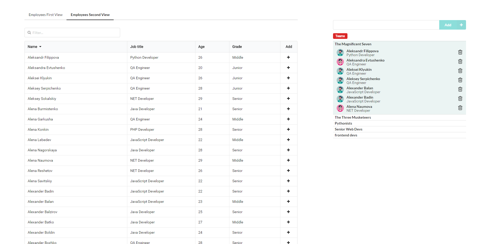

# Project Team Manager

App to manage project teams of developers


## Getting Started

To run the app you should:

1. Run ```npm i```
2. Run ```npm start```
3. Open your browser on: ```http://localhost:3000/```.


You should see:




## Built With

The app is created using Angular 1.5.0, ES201 with Babel, SemanticUI, PostCSS.

## Authors

* Dominik Broj
